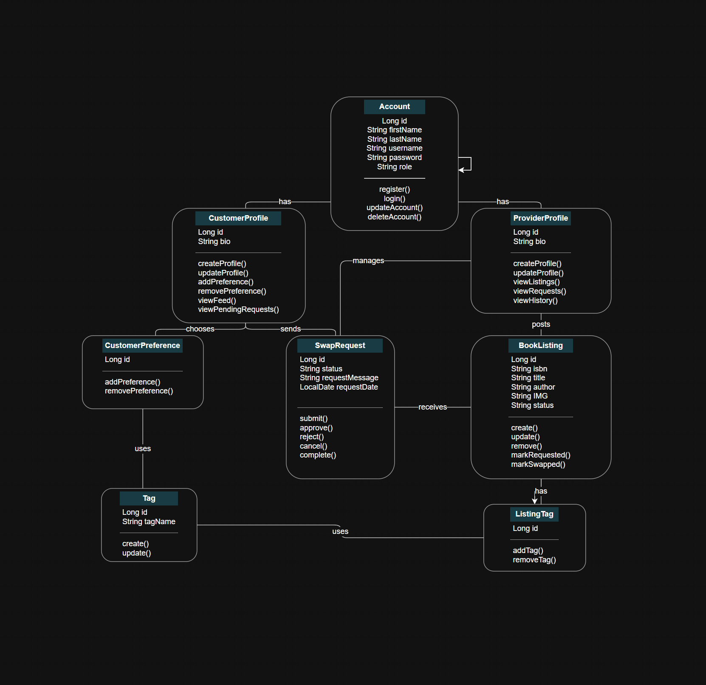

# Swap-A-Bookaroo Backend API

**Version:** 1.0  
**Last Updated:** July 10, 2026

**Base URL:**

- local: http://localhost:8080
- production:

## Table of Contents

1. [Overview](#1-overview)
2. [UML Class Diagram](#2-uml-class-diagram)
3. [API Endpoints](#3-api-endpoints)
   - [Customer Endpoints](#31-customer-endpoints)
   - [Provider Endpoints](#32-provider-endpoints)
   - [Book Listing Endpoints](#33-book-listing-endpoints)
   - [Tag Endpoints](#34-tag-endpoints)
   - [Swap Request Endpoints](#35-swap-request-endpoints)
   - [Swap History Endpoints](#36-swap-history-endpoints)
4. [Use Case Mapping](#4-use-case-mapping)

---

## 1. Overview

The Swap-A-Bookaroo backend demonstrates to API for a genre-based book-swapping platform. The system allows customers to find books based on genre preferences and allows providers to list books they want to swap with other users.


---

## 2. UML Class Diagram



---

## 3. API Endpoints

### 3.1 Customer Endpoints

#### Create a customer

```http
POST /api/customer-profiles
```

Request body:

```json
{
  "account": {
    "firstName": "Jacob",
    "lastName": "McGinniss",
    "username": "jacob_c",
    "password": "securePassword123"
  },
  "bio": "Avid reader focusing on high-fantasy and sci-fi classics."
}
```

Example response:

```json
{
	"customerProfileId": 1,
	"account": {
		"accountId": 1,
		"firstName": "Jacob",
		"lastName": "McGinniss",
		"username": "jacob_c"
	},
	"bio": "Avid reader focusing on high-fantasy and sci-fi classics.",
	"preferences": null
}
```

#### Get all customers

```http
 GET /api/customer-profiles
```

Example response:

```json
[
	{
		"customerProfileId": 1,
		"account": {
			"accountId": 1,
			"firstName": "Jacob",
			"lastName": "McGinniss",
			"username": "jacob_c"
		},
		"bio": "Avid reader focusing on high-fantasy and sci-fi classics.",
		"preferences": []
	}
]
```

#### Get a customer by id

```http
 GET /api/customer-profiles/{customerProfileId}
```

Example response:

```json
[
	{
		"customerProfileId": 1,
		"account": {
			"accountId": 1,
			"firstName": "Jacob",
			"lastName": "McGinniss",
			"username": "jacob_c"
		},
		"bio": "Avid reader focusing on high-fantasy and sci-fi classics.",
		"preferences": []
	}
]
```

#### Get a customer by account id

```http
 GET /api/customer-profiles/account/{accountId}
```

Example response:

```json
[
	{
		"customerProfileId": 1,
		"account": {
			"accountId": 1,
			"firstName": "Jacob",
			"lastName": "McGinniss",
			"username": "jacob_c"
		},
		"bio": "Avid reader focusing on high-fantasy and sci-fi classics.",
		"preferences": []
	}
]
```

#### Update a customer profile

```http
 PUT /api/customer-profiles/{customerProfileId}
```

Example request body:

```json
{

}
```

#### Delete a customer profile

```http
 DELETE /api/customer-profiles/{customerProfileId}
```

#### Add a customer preference tag

```http
 POST /api/customer-profiles/{customerProfileId}/preferences
```

Example request body:

```json
{
  "tagName": "Sci-Fi"
}
```

#### Get customer preference tags

```http
 GET /api/customer-profiles/{customerProfileId}/preferences
```

#### Remove a customer preference tag

```http
 DELETE /api/customer-profiles/{customerProfileId}/preferences/{tagId}
```

#### Get matched book feed for a customer

```http
 GET /api/customer-profiles/{customerProfileId}/feed
```

#### Create a swap request

```http
 POST /api/swap-requests
```

Request body:

```json
{

}
```

Example response:

```json
{

}
```

#### Get pending swap requests for a customer

```http
 GET /api/swap-requests/customer/{customerProfileId}/pending
```

---

### 3.2 Account Endpoints

Account endpoints support login, account lookup, account updates, and account deletion. There is no standalone create-account endpoint in the current backend; provider accounts are created through the provider profile endpoint.

#### Log in to an account

```http
POST /api/accounts/login
```

Request body:

```json
{
  "username": "yeraldine_provider",
  "password": "password123"
}
```

Example response:

```json
{
  "accountId": 1,
  "firstName": "Yeraldine",
  "lastName": "Tamayo",
  "username": "yeraldine_provider",
  "password": "password123",
  "role": "PROVIDER"
}
```

#### Get an account by id

```http
GET /api/accounts/{accountId}
```

Example response:

```json
{
  "accountId": 1,
  "firstName": "Yeraldine",
  "lastName": "Tamayo",
  "username": "yeraldine_provider",
  "password": "password123",
  "role": "PROVIDER"
}
```

#### Update an account

```http
PUT /api/accounts/{accountId}
```

Example request body:

```json
{
  "firstName": "Yeraldine",
  "lastName": "Tamayo",
  "username": "yeraldine_provider_updated",
  "password": "newpassword123"
}
```

Example response:

```json
{
  "accountId": 1,
  "firstName": "Yeraldine",
  "lastName": "Tamayo",
  "username": "yeraldine_provider_updated",
  "password": "newpassword123",
  "role": "PROVIDER"
}
```

#### Delete an account

```http
DELETE /api/accounts/{accountId}
```

---

### 3.3 Provider Profile Endpoints

Provider profile endpoints support provider account/profile creation, provider lookup, provider deletion, active listing lookup, pending swap request lookup, and completed swap history lookup.

#### Create a provider profile

```http
POST /api/provider-profiles
```

Request body:

```json
{
  "account": {
    "firstName": "Yeraldine",
    "lastName": "Tamayo",
    "username": "yeraldine_provider",
    "password": "password123"
  },
}
```

Example response:

```json
{
  "providerProfileId": 1,
  "account": {
    "accountId": 1,
    "firstName": "Yeraldine",
    "lastName": "Tamayo",
    "username": "yeraldine_provider",
    "role": "PROVIDER"
  },
  "swapCreditBalance": 0,
  "bookListings": []
}
```

#### Get all provider profiles

```http
GET /api/provider-profiles
```

Example response:

```json
[
  {
    "providerProfileId": 1,
    "account": {
      "accountId": 1,
      "firstName": "Yeraldine",
      "lastName": "Tamayo",
      "username": "yeraldine_provider",
      "role": "PROVIDER"
    },
    "swapCreditBalance": 0,
    "bookListings": []
  }
]
```

#### Get a provider profile by id

```http
GET /api/provider-profiles/{providerProfileId}
```

Example response:

```json
{
  "providerProfileId": 1,
  "account": {
    "accountId": 1,
    "firstName": "Yeraldine",
    "lastName": "Tamayo",
    "username": "yeraldine_provider",
    "role": "PROVIDER"
  },
  "swapCreditBalance": 0,
  "bookListings": []
}
```

#### Get a provider profile by account id

```http
GET /api/provider-profiles/account/{accountId}
```

Example response:

```json
{
  "providerProfileId": 1,
  "account": {
    "accountId": 1,
    "firstName": "Yeraldine",
    "lastName": "Tamayo",
    "username": "yeraldine_provider",
    "role": "PROVIDER"
  },
  "swapCreditBalance": 0,
  "bookListings": []
}
```


#### Delete a provider profile

```http
DELETE /api/provider-profiles/{providerProfileId}
```

#### Get active listings for a provider

```http
GET /api/provider-profiles/{providerProfileId}/listings
```

Example response:

```json
[
  {
    "listingId": 1,
    "isbn": "9780547928227",
    "title": "The Hobbit",
    "author": "J.R.R. Tolkien",
    "IMG": "https://example.com/the-hobbit.jpg",
    "status": "AVAILABLE",
    "datePosted": "2026-07-10 12:00"
  }
]
```

#### Get pending swap requests for a provider

```http
GET /api/provider-profiles/{providerProfileId}/swap-requests/pending
```

Example response:

```json
[
  {
    "requestId": 1,
    "customerProfile": {
      "accountId": 2,
      "firstName": "Jacob",
      "lastName": "McGinniss",
      "username": "jacob_customer",
      "role": "CUSTOMER"
    },
    "bookListing": {
      "listingId": 1,
      "isbn": "9780547928227",
      "title": "The Hobbit",
      "author": "J.R.R. Tolkien",
      "IMG": "https://example.com/the-hobbit.jpg",
      "status": "REQUESTED"
    },
    "status": "PENDING",
    "requestDate": "2026-07-10 12:00"
  }
]
```

#### Get completed swap history for a provider

```http
GET /api/provider-profiles/{providerProfileId}/swap-history
```

Example response:

```json
[
  {
    "requestId": 1,
    "customerProfile": {
      "accountId": 2,
      "firstName": "Jacob",
      "lastName": "McGinniss",
      "username": "jacob_customer",
      "role": "CUSTOMER"
    },
    "bookListing": {
      "listingId": 1,
      "isbn": "9780547928227",
      "title": "The Hobbit",
      "author": "J.R.R. Tolkien",
      "IMG": "https://example.com/the-hobbit.jpg",
      "status": "SWAPPED"
    },
    "status": "COMPLETED",
    "requestDate": "2026-07-10 12:00",
    "completedDate": "2026-07-11 14:30"
  }
]
```

---

### 3.4 Book Listing Endpoints

Book listing endpoints allow providers to create, view, edit, and remove book listings. In the current backend, a book listing uses `IMG` and `tagNames`. The `tagNames` list must contain at least three tags.

#### Create a book listing

```http
POST /api/book-listings/provider/{providerProfileId}
```

Request body:

```json
{
  "isbn": "9780547928227",
  "title": "The Hobbit",
  "author": "J.R.R. Tolkien",
  "IMG": "https://example.com/the-hobbit.jpg",
  "tagNames": ["Fantasy", "Adventure", "Classic"]
}
```

Example response:

```json
{
  "listingId": 1,
  "isbn": "9780547928227",
  "title": "The Hobbit",
  "author": "J.R.R. Tolkien",
  "IMG": "https://example.com/the-hobbit.jpg",
  "status": "AVAILABLE",
  "datePosted": "2026-07-10 12:00",
  "listingTags": [
    {
      "listingTagId": 1,
      "tag": {
        "tagId": 1,
        "tagName": "Fantasy"
      }
    },
    {
      "listingTagId": 2,
      "tag": {
        "tagId": 2,
        "tagName": "Adventure"
      }
    },
    {
      "listingTagId": 3,
      "tag": {
        "tagId": 3,
        "tagName": "Classic"
      }
    }
  ]
}
```

#### Get a book listing by id

```http
GET /api/book-listings/{listingId}
```

Example response:

```json
{
  "listingId": 1,
  "isbn": "9780547928227",
  "title": "The Hobbit",
  "author": "J.R.R. Tolkien",
  "IMG": "https://example.com/the-hobbit.jpg",
  "status": "AVAILABLE",
  "datePosted": "2026-07-10 12:00",
  "listingTags": [
    {
      "listingTagId": 1,
      "tag": {
        "tagId": 1,
        "tagName": "Fantasy"
      }
    }
  ]
}
```

#### Update a book listing

```http
PUT /api/book-listings/{listingId}
```

Example request body:

```json
{
  "isbn": "9780547928227",
  "title": "The Hobbit",
  "author": "J.R.R. Tolkien",
  "IMG": "https://example.com/the-hobbit-updated.jpg",
  "tagNames": ["Fantasy", "Adventure", "Classic"]
}
```

Example response:

```json
{
  "listingId": 1,
  "isbn": "9780547928227",
  "title": "The Hobbit",
  "author": "J.R.R. Tolkien",
  "IMG": "https://example.com/the-hobbit-updated.jpg",
  "status": "AVAILABLE",
  "datePosted": "2026-07-10 12:00"
}
```

#### Remove a book listing

```http
DELETE /api/book-listings/{listingId}
```

---

### 3.5 Swap Request Endpoints

Swap request endpoints allow a provider to look up, approve, reject, and complete existing swap requests. In the current backend, swap requests must already exist in the database before these endpoints can return or update them.

#### Get a swap request by id

```http
GET /api/swap-requests/{requestId}
```

Example response:

```json
{
  "requestId": 1,
  "customerProfile": {
    "accountId": 2,
    "firstName": "Jacob",
    "lastName": "McGinniss",
    "username": "jacob_customer",
    "role": "CUSTOMER"
  },
  "bookListing": {
    "listingId": 1,
    "isbn": "9780547928227",
    "title": "The Hobbit",
    "author": "J.R.R. Tolkien",
    "IMG": "https://example.com/the-hobbit.jpg",
    "status": "REQUESTED"
  },
  "status": "PENDING",
  "requestDate": "2026-07-10 12:00"
}
```

#### Approve a swap request

```http
PUT /api/swap-requests/{requestId}/approve
```

Example response:

```json
{
  "requestId": 1,
  "status": "APPROVED",
  "requestDate": "2026-07-10 12:00",
  "responseDate": "2026-07-10 13:00"
}
```

#### Reject a swap request

```http
PUT /api/swap-requests/{requestId}/reject
```

Example response:

```json
{
  "requestId": 1,
  "status": "REJECTED",
  "requestDate": "2026-07-10 12:00",
  "responseDate": "2026-07-10 13:00"
}
```

#### Complete a swap request

```http
PUT /api/swap-requests/{requestId}/complete
```

Example response:

```json
{
  "requestId": 1,
  "status": "COMPLETED",
  "requestDate": "2026-07-10 12:00",
  "completedDate": "2026-07-11 14:30"
}
```

---

## 4. Use Case Mapping

The API endpoints support the following SRS user stories and acceptance flows described in the requirements document.

### Customer use cases

| SRS use case | Related Endpoints |
| ------------ | ----------------- |
| US-1 Register and manage customer profile | 
| US-2 Find books based on preferences | 
| US-3 Request a book swap | 
| US-4 View pending book swaps | 

### Provider use cases

| SRS use case | Related Endpoints |
| ------------ | ----------------- |
| US-5 Create and manage provider profile | `POST /api/provider-profiles`, `GET /api/provider-profiles`, `GET /api/provider-profiles/{providerProfileId}`, `GET /api/provider-profiles/account/{accountId}`, `PUT /api/provider-profiles/{providerProfileId}`, `DELETE /api/provider-profiles/{providerProfileId}`, `POST /api/accounts/login`, `GET /api/accounts/{accountId}`, `PUT /api/accounts/{accountId}`, `DELETE /api/accounts/{accountId}` |
| US-6 Create book listings | `POST /api/book-listings/provider/{providerProfileId}` |
| US-7 Manage book listings | `GET /api/provider-profiles/{providerProfileId}/listings`, `GET /api/book-listings/{listingId}`, `PUT /api/book-listings/{listingId}`, `DELETE /api/book-listings/{listingId}` |
| US-8 Record listing history and manage requests | `GET /api/provider-profiles/{providerProfileId}/swap-requests/pending`, `GET /api/provider-profiles/{providerProfileId}/swap-history`, `GET /api/swap-requests/{requestId}`, `PUT /api/swap-requests/{requestId}/approve`, `PUT /api/swap-requests/{requestId}/reject`, `PUT /api/swap-requests/{requestId}/complete` |
